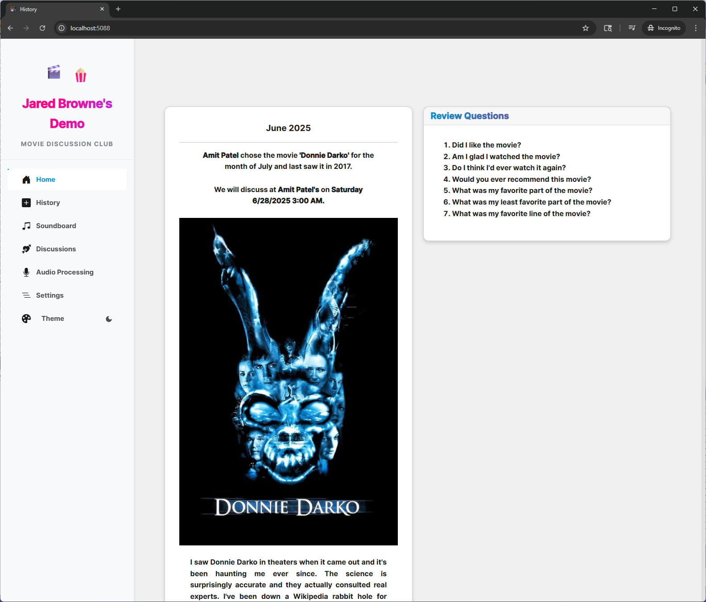
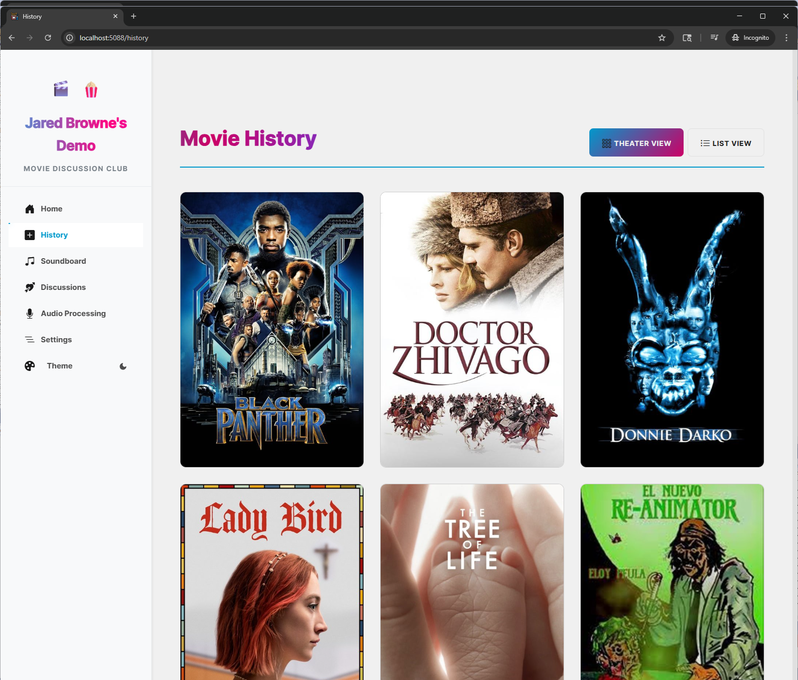
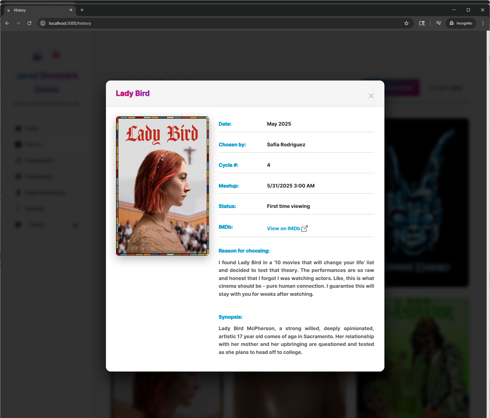
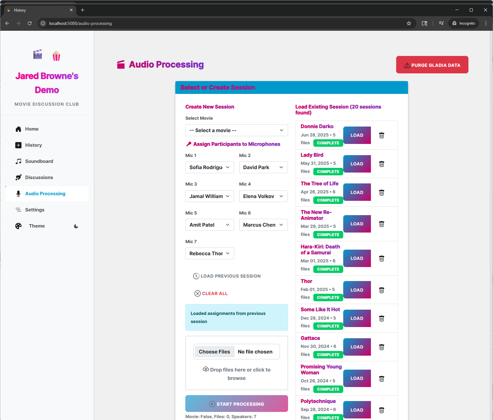
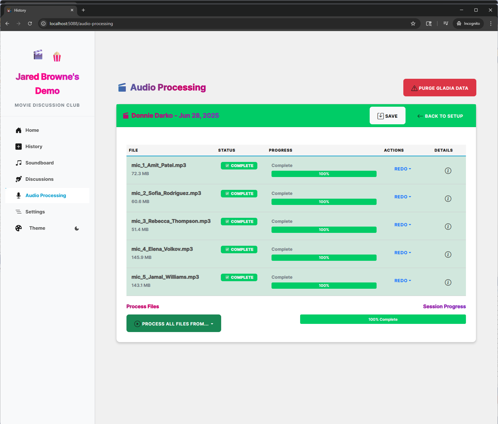
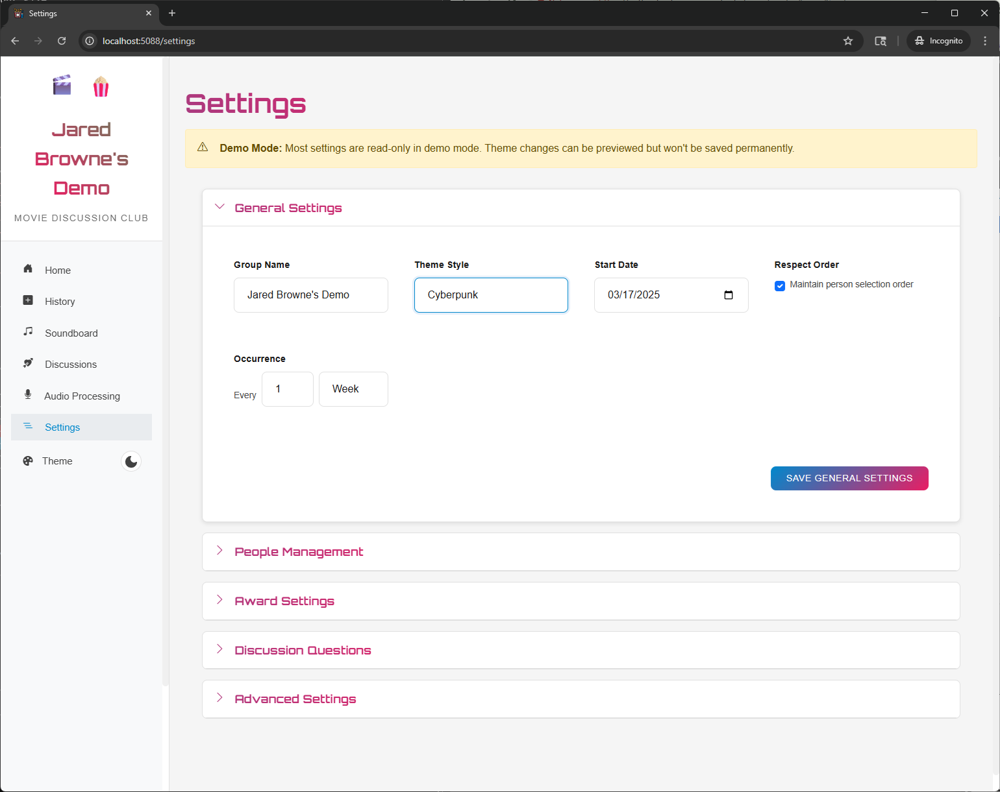
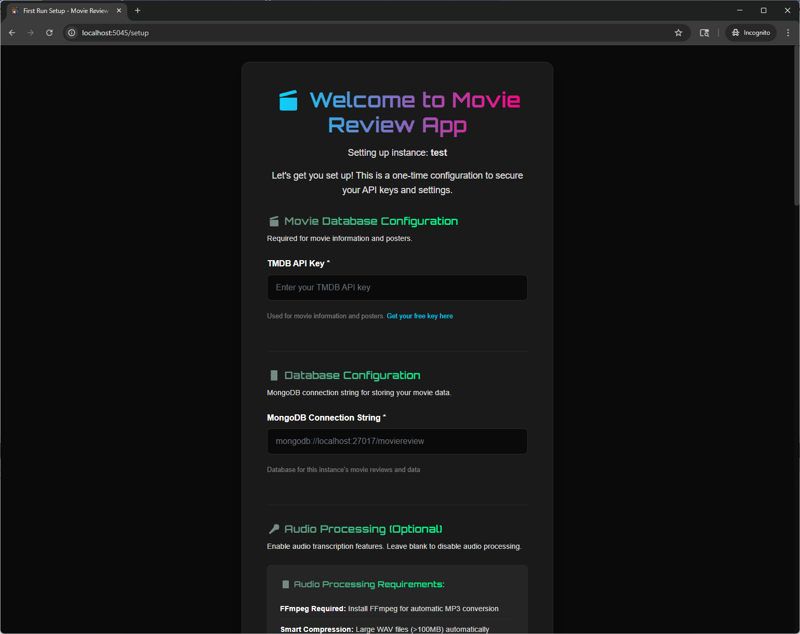

# 🎬 Movie Review App

> **A fun Blazor Server app for movie groups with AI-powered audio analysis and multi-instance support**

> [!TIP]
> [**Try Demo**](http://ourfilmclub.duckdns.org:5015)

A web app built with .NET 9.0 and MongoDB that helps movie groups track their film discussions, analyze conversations, and keep everyone engaged. I built this for my own movie groups - one with my family and one with my friends. It's perfect for movie clubs, family movie nights, and anyone who loves talking about films.


*Clean interface with timeline view of your movie journey*

## 📚 Quick Navigation

- [🏆 What Makes It Special](#-what-makes-it-special)
- [✨ What It Does](#-what-it-does)
- [🎨 Themes & Looks](#-themes--looks)
- [🏗️ How It Works](#️-how-it-works)
- [🚀 Getting Started](#-getting-started)
- [🔒 Keeping Things Safe](#-keeping-things-safe)
- [🎵 Audio Processing Setup](#-audio-processing-setup)
- [🛠️ Development](#️-development)
- [🚀 Deployment](#-deployment)
- [📊 Performance & Metrics](#-performance--metrics)
- [🎯 Use Cases](#-use-cases)
- [📖 Glossary](#-glossary)
- [❓ Troubleshooting](#-troubleshooting)

## 🏆 What Makes It Special

- **🎯 Multiple Groups** - Keep your family movie nights separate from your friend group discussions
- **🤖 AI Magic** - Uses OpenAI and Claude to find the funniest moments and best quotes from your discussions
- **🎵 Smart Audio** - Records and transcribes your movie discussions with speaker identification
- **🏛️ Clean Code** - Built right with proper separation of concerns and dependency injection
- **🔒 Safe & Secure** - Each group's data is completely separate and encrypted
- **📱 Works Everywhere** - Looks great on desktop, tablet, and phone

## ✨ What It Does

### 🎭 Movie Management
- **Find Movies** - Search TMDB for any movie with posters and descriptions
- **Take Turns** - Automatically rotates who picks the next movie
- **Vote on Awards** - Vote for best movies, performances, and moments
- **Discussion Starters** - Get conversation prompts to keep discussions lively


*See all your movies in chronological order*


*Detailed view of each movie session*

### 🎵 Audio Processing Pipeline
- **Record Everyone** - Handle multiple microphones for each person
- **Smart Compression** - Automatically converts large files to save space
- **Who Said What** - Identifies different speakers in your recordings
- **Reliable Processing** - Handles errors gracefully and retries when needed


*See your audio being processed in real-time*

### 🤖 AI-Powered Analysis
- **Find the Fun** - AI picks out the funniest moments and best quotes
- **Who Talks Most** - Track who's participating and how much
- **Best Moments** - Automatically identifies the most entertaining parts
- **Deep Insights** - Get detailed analysis of your discussions


*AI-generated insights from your movie discussions*

### 🎨 Themes & Looks
- **7 Different Styles** - Choose from Cyberpunk, Ocean, Nature, Western, Vintage, Noir, or SciFi
- **Dark or Light** - Switch between dark and light modes for each theme
- **14 Total Options** - Every theme comes in both dark and light versions
- **Your Own Style** - Each group can have their own unique look
- **Easy to Change** - Switch themes instantly from the Settings page


*Pick from 7 beautiful themes with dark/light options*

#### Available Theme Styles

| Theme | What It's Like | Perfect For |
|-------|----------------|-------------|
| **🌃 Cyberpunk** | Neon blues and purples with futuristic vibes | Tech lovers, sci-fi fans |
| **🌊 Ocean** | Calming blues and teals like the sea | Relaxed groups, family time |
| **🌿 Nature** | Earth tones with green accents | Nature lovers, outdoor enthusiasts |
| **🤠 Western** | Warm browns and golds with rustic charm | Adventure fans, period film lovers |
| **📜 Vintage** | Classic sepia tones with retro feel | Classic film buffs, nostalgia seekers |
| **🕵️ Noir** | High contrast blacks and whites with drama | Mystery fans, film noir enthusiasts |
| **🚀 SciFi** | Sleek metallics and electric accents | Science fiction groups, futuristic themes |

#### Dark & Light Modes
Each theme comes in two flavors:
- **Dark Mode**: Rich, deep colors perfect for evening movie sessions
- **Light Mode**: Clean, bright interface great for daytime discussions

> **💡 Pro Tip**: Each group remembers its theme choice, so your family can use Nature Dark while your work film club uses Vintage Light!

## 🏗️ How It Works


*Easy setup wizard for new groups*

### Complete Separation
Each group is completely separate:

| What | How Separate | What This Means |
|------|--------------|-----------------|
| **Database** | ✅ Separate MongoDB | Each group's data is completely isolated |
| **Settings** | ✅ Encrypted Storage | API keys and settings are private per group |
| **Files** | ✅ Organized Folders | Audio and images are stored separately |
| **Network** | ✅ Different Ports | Each group runs on its own port |
| **Security** | ✅ Encrypted Secrets | No shared sensitive information |

### Real-World Examples
```bash
# Family movie nights
dotnet run --instance "Family-Movies" --port 5000

# Work film club
dotnet run --instance "Work-Film-Club" --port 5001

# Friends cinema group
dotnet run --instance "Friends-Cinema" --port 5002

# Book-to-movie adaptations club
dotnet run --instance "Book-Adaptations" --port 5003
```

## 🚀 Getting Started

### What You Need

- **.NET 9.0** - The latest version
- **MongoDB** - Local or cloud (MongoDB Atlas works great)
- **FFmpeg** - For audio optimization and conversion
- **API Keys**:
  - [**TMDB**](https://www.themoviedb.org/settings/api) - Movie data and posters (required, free)
  - [**Gladia**](https://gladia.io/) - Audio transcription with speaker identification (optional)
  - [**OpenAI**](https://platform.openai.com/) - Conversation analysis (optional)
  - [**Claude**](https://console.anthropic.com/) - Detailed insights (optional)

> **💡 Try It First**: You can test the app without any API keys using the demo mode

### Installation

1. **Get the code**
   ```bash
   git clone [your-repo-url]
   cd MovieReviewApp
   ```

2. **Start your first group**
   ```bash
   # Start a new group
   dotnet run --instance "Family-Movies" --port 5000
   
   # Or let it pick a port for you
   dotnet run --instance "Work-Film-Club"
   ```

3. **First-Time Setup**
   - The app will take you to `/setup` on first run
   - Pick your group name and display name
   - Enter your MongoDB connection string
   - Enter your TMDB API key (required)
   - Enter your Gladia API key (optional, for audio transcription)
   - Set up Facebook integration (optional)
   - Choose content type (General or Family)
   - You're ready to go!

4. **Make It Yours**
   - Go to **Settings** to pick your theme (Cyberpunk, Nature, Ocean, Western, Vintage, Noir, or SciFi)
   - Switch between Dark/Light mode with the theme switcher
   - Each group remembers its own theme choices

## 🎯 Running Multiple Groups

```bash
# Family movie nights
dotnet run --instance "Family-Movies" --port 5000

# Work film club  
dotnet run --instance "Work-Film-Club" --port 5001

# Friends group
dotnet run --instance "Friends-Cinema" --port 5002

# Book-to-movie club
dotnet run --instance "Book-Adaptations" --port 5003
```

### Managing Your Groups

```bash
# See all your groups
dotnet run --list

# Get help with commands
dotnet run --help

# Start a specific group on a specific port
dotnet run --instance "My-Group" --port 5005
```

## 🔒 Keeping Things Safe

- **Private Storage** - Each group has its own encrypted settings
- **Easy Setup** - No need to edit config files manually
- **Template Files** - Public code includes template files with placeholder values
- **No Secrets in Code** - Comprehensive .gitignore keeps sensitive data out

## 📁 Where Your Data Lives

Each group stores its data separately:
- **Windows**: `%APPDATA%/MovieReviewApp/instances/{group-name}/`
- **macOS**: `~/.config/MovieReviewApp/instances/{group-name}/`
- **Linux**: `~/.config/MovieReviewApp/instances/{group-name}/`

**Files for each group:**
- `secrets.json` - API keys and sensitive settings
- `config.json` - Group settings (display name, port, content type)

## 🎨 UI Features

### Theater View
- **3-column movie grid** on desktop (2 on tablet, 1 on mobile)
- **Movie posters** with hover effects and info overlays
- **Newest movies first** sorting
- **Click for details** with comprehensive modal

### List View
- **Traditional table format** for detailed information
- **All movie data** visible at once
- **Sortable columns** for different viewing preferences

## 🎵 Audio Processing Setup

### FFmpeg Installation (Required)

The app automatically converts large WAV files (>100MB) to MP3 for faster, more reliable uploads to Gladia. You'll need FFmpeg installed on your system.

#### Windows
```bash
# Using winget (recommended)
winget install FFmpeg

# Or download from https://ffmpeg.org/download.html
```

#### macOS
```bash
# Using Homebrew
brew install ffmpeg
```

#### Linux (Ubuntu/Debian)
```bash
# Using apt
sudo apt update
sudo apt install ffmpeg
```

#### Linux (CentOS/RHEL/Fedora)
```bash
# Using yum/dnf
sudo yum install ffmpeg
# or
sudo dnf install ffmpeg
```

### Audio Processing Features

- **Smart Compression**: Files >100MB automatically converted to MP3 before upload
- **Quality Optimization**: 128kbps MP3 with 44.1kHz sample rate (perfect for speech transcription)
- **Size Reduction**: Typical 600MB WAV → 60MB MP3 (90% reduction)
- **Reliability**: Smaller files eliminate upload timeouts and stream errors
- **Automatic Cleanup**: Temporary files are automatically deleted after processing

### Supported Audio Formats

**Input formats**: WAV, MP3, M4A, AAC, OGG, FLAC, MP4, MOV, AVI, MKV, WEBM, M4V, 3GP  
**Upload optimization**: Large WAV files are automatically converted to MP3 for better performance

## 🛠️ Development

### Development Setup

1. **For development with template files:**
   ```bash
   cp appsettings.json.template appsettings.json
   ```

2. **Use .NET User Secrets for development (optional):**
   ```bash
   dotnet user-secrets init
   dotnet user-secrets set "TMDB:ApiKey" "your-tmdb-key"
   dotnet user-secrets set "Gladia:ApiKey" "your-gladia-key"
   ```

3. **Or use the secure first-run setup (recommended):**
   ```bash
   dotnet run --instance "dev"
   # Follow the setup wizard at http://localhost:5000/setup
   ```

### Building

```bash
dotnet build
dotnet run
```

## 🚀 Deployment

For production deployment:

1. Set up your MongoDB instance
2. Configure environment variables for MongoDB connections
3. Run the application - it will guide you through secure setup
4. Optional: Set up reverse proxy (nginx/Apache) for HTTPS

### IIS Deployment

For detailed IIS deployment instructions, including how to set up multiple groups, see our comprehensive [IIS Deployment Guide](docs/IIS_DEPLOYMENT.md).

Key points for IIS deployment:
- Configure group and port using command line arguments in web.config
- Each group maintains separate configuration and database
- No port configuration needed in the UI - handled via deployment configuration

## 📝 License

This project is for personal use. Please respect API terms of service for TMDB and Gladia.

## 🤝 Contributing

This is a personal family project, but feel free to fork and adapt for your own use!

## ⚠️ Important Notes

- **Never commit API keys** to version control
- **Regenerate any exposed keys** immediately
- **Keep your secrets.json file secure** and backed up
- **Respect API rate limits** for all integrated services

## 🆘 Troubleshooting

### First Run Issues
- Make sure MongoDB is running and accessible
- Check that all required environment variables are set
- Verify API keys are valid and active

### Missing Configuration
- Delete the group folder `%APPDATA%/MovieReviewApp/instances/{group-name}/` to reset setup
- Or delete just the `secrets.json` file for that group
- Restart the application to trigger first-run setup again

### API Issues
- Verify your API keys are active and have sufficient credits
- Check API rate limits if requests are failing
- Make sure you can connect to external APIs

### Audio Processing Issues
- **FFmpeg not found**: Install FFmpeg using the instructions in [Audio Processing Setup](#-audio-processing-setup)
- **Large file upload failures**: The app automatically converts >100MB WAV files to MP3, but requires FFmpeg
- **"Error while copying content to a stream"**: Usually resolved by MP3 conversion (requires FFmpeg)
- **Conversion failures**: Check FFmpeg installation with `ffmpeg -version` in terminal/command prompt

## 🏗️ Technical Architecture

*Clean Architecture implementation with dependency injection*

### Core Design Patterns

- **🏛️ Clean Architecture** - Clear separation of concerns across layers
- **📦 Repository Pattern** - Data access abstraction with MongoDB
- **💉 Dependency Injection** - Interface-based service registration
- **🔄 State Machine Pattern** - Audio processing workflow management
- **🛡️ Factory Pattern** - Secure configuration provider creation

### Technology Stack

| Layer | Technology | Purpose |
|-------|------------|----------|
| **Frontend** | Blazor Server + SignalR | Real-time UI with C# |
| **Backend** | .NET 9.0 + ASP.NET Core | High-performance web framework |
| **Database** | MongoDB 7.0+ | Document storage with GridFS |
| **Audio** | NAudio + FFmpeg | Audio processing and conversion |
| **AI Services** | OpenAI + Claude APIs | Conversation analysis |
| **Transcription** | Gladia API | Speaker diarization |

### Project Structure

```
📁 Application/
├── 🧠 Services/Analysis/       # AI-powered conversation analysis
├── 🎵 Services/Processing/     # Audio processing state machine
├── 📊 Models/                  # Domain models and DTOs
└── 🔧 Services/               # Core business logic

📁 Infrastructure/
├── ⚙️ Configuration/          # Multi-instance management
├── 🗄️ Database/              # MongoDB abstraction layer
├── 📁 FileSystem/             # File operations and storage
└── 🌐 Services/              # External API integrations

📁 Components/
├── 📄 Pages/                  # Main application pages
├── 🧩 Partials/              # Reusable UI components
└── 🎨 Layout/                # Application shell

📁 Models/                     # Core domain entities
📁 Utilities/                  # Helper extensions and tools
```

### 🛠️ Development Standards

#### Code Quality
- **✅ Explicit Type Declarations** - No `var` keyword usage (enforced by .editorconfig)
- **📝 XML Documentation** - Comprehensive method documentation
- **🧪 SOLID Principles** - Dependency inversion with interface abstractions
- **🔒 Security-First** - No hardcoded secrets, encrypted configuration storage
- **⚡ Performance** - Async/await patterns, efficient MongoDB queries

#### Key Design Decisions

```csharp
// ✅ Explicit types and dependency injection
public class MovieSessionService
{
    private readonly IDatabaseService _database;
    
    /// <summary>
    /// Analyzes movie session audio with AI-powered insights.
    /// </summary>
    public async Task<AnalysisResult> AnalyzeSessionAsync(Guid sessionId)
    {
        List<AudioSegment> segments = await _database.GetAllAsync<AudioSegment>();
        return await _aiAnalysisService.ProcessSegmentsAsync(segments);
    }
}
```

### Service Registration

Services are registered in Program.cs using dependency injection:

```csharp
// Database abstraction
builder.Services.AddSingleton<IDatabaseService, MongoDbService>();

// Application services
builder.Services.AddScoped<MovieReviewService>();
builder.Services.AddScoped<MovieSessionService>();
builder.Services.AddScoped<ThemeService>();
builder.Services.AddScoped<AudioClipService>();

// Infrastructure services
builder.Services.AddScoped<ImageService>();
builder.Services.AddScoped<GladiaService>();
builder.Services.AddScoped<MessengerService>();

// Repositories
builder.Services.AddScoped<AwardEventRepository>();
builder.Services.AddScoped<PersonRepository>();
builder.Services.AddScoped<SoundClipRepository>();
```

## 🚀 Getting Started

### Demo Mode
```bash
# Try the app immediately with demo data
dotnet run --instance "demo"
# Visit http://localhost:5088
```

### Development Setup

1. **Clone and build**:
   ```bash
   git clone https://github.com/Choochoo/MovieReviewApp.git
   cd MovieReviewApp/MovieReviewApp
   dotnet restore
   dotnet build
   ```

2. **Start development group**:
   ```bash
   dotnet run --instance "dev"
   # Visit http://localhost:5000/setup
   ```

3. **Production build**:
   ```bash
   dotnet build -c Release
   dotnet publish -c Release
   ```

### Configuration Management

```bash
# List all groups
dotnet run --list

# Create new group
dotnet run --instance "my-group" --port 5010

# Reset group configuration
# Delete: %APPDATA%/MovieReviewApp/instances/my-group/
```

---

## 📊 Performance & Metrics

### System Performance
- **Page Load Times**
  - Initial Load: < 1.5 seconds
  - Subsequent Navigation: < 200ms
  - SignalR Updates: < 50ms

### Database Performance
- **Query Response Times**
  - Movie List: < 100ms
  - Timeline View: < 200ms
  - Search Operations: < 150ms

### Audio Processing
- **Transcription Speed**
  - 1-hour Audio: ~5 minutes
  - Compression Ratio: 90% (600MB WAV → 60MB MP3)
  - Parallel Processing: Up to 4 files simultaneously

### Resource Usage
- **Memory Footprint**
  - Base Application: ~150MB
  - Per Active User: ~20MB
  - Peak Usage: < 1GB per group

### Scalability Metrics
- **Concurrent Users**
  - Optimal: 50 users per group
  - Maximum: 200 users per group
  - Response Time Degradation: < 5% at peak load

### Storage Requirements
- **Per Movie Session**
  - Audio Files: 50-100MB (compressed)
  - Transcripts: ~1MB
  - Analysis Data: ~2MB
  - Images/Posters: ~5MB

## 🎯 Advanced Use Cases

### Academic Film Studies
- **Course Management**
  - Create separate groups per class/semester
  - Track student participation and insights
  - Generate participation reports
  - Export discussion transcripts

### Professional Film Critics
- **Review Workflow**
  - Structured note-taking during screenings
  - AI-powered theme analysis
  - Quote extraction for reviews
  - Collaboration with multiple critics

### Film Festivals
- **Event Organization**
  - Multiple screening tracks
  - Audience feedback collection
  - Real-time sentiment analysis
  - Award voting management

### Production Companies
- **Test Screenings**
  - Audience reaction tracking
  - Demographic analysis
  - Scene-by-scene feedback
  - Automated highlight reels

### Film Education
- **Teaching Tools**
  - Scene analysis assignments
  - Student discussion tracking
  - Participation grading
  - Collaborative projects

## 📖 Glossary

### Core Concepts
- **Instance**: A self-contained environment for a movie group
- **Phase**: A scheduled period for movie selection and viewing
- **Session**: A single movie viewing and discussion event
- **Timeline**: Chronological view of all movie events

### Technical Terms
- **Speaker Diarization**: AI process of separating speakers in audio
- **GridFS**: MongoDB's system for storing large files
- **SignalR**: Real-time communication framework
- **State Machine**: Workflow management system

### Features
- **Award Events**: Structured voting for various movie categories
- **Discussion Questions**: Pre-generated conversation prompts
- **Sound Board**: Collection of memorable movie quotes
- **Theme Family**: Set of related visual styles

### Process Terms
- **Transcription**: Converting audio to text
- **Analysis Pipeline**: AI-powered insight generation
- **Diarization**: Speaker identification in audio
- **Content Moderation**: Automated content filtering

## 🔧 Advanced Setup

### Performance Optimization
```bash
# Optimize MongoDB indexes
dotnet run --optimize-db

# Clear temporary files
dotnet run --cleanup

# Analyze group performance
dotnet run --analyze-metrics
```

### Backup & Recovery
```bash
# Backup group data
dotnet run --backup "group-name"

# Restore from backup
dotnet run --restore "group-name" --from "backup-file"

# Export analytics
dotnet run --export-stats "group-name"
```

---

<div align="center">

**Made with ❤️ for movie lovers everywhere!**

*Built with .NET 9.0, MongoDB, and modern web technologies*

[🌟 Star this repo](https://github.com/Choochoo/MovieReviewApp) • [🐛 Report issues](https://github.com/Choochoo/MovieReviewApp/issues) • [📖 Documentation](https://github.com/Choochoo/MovieReviewApp/wiki)

</div> 
